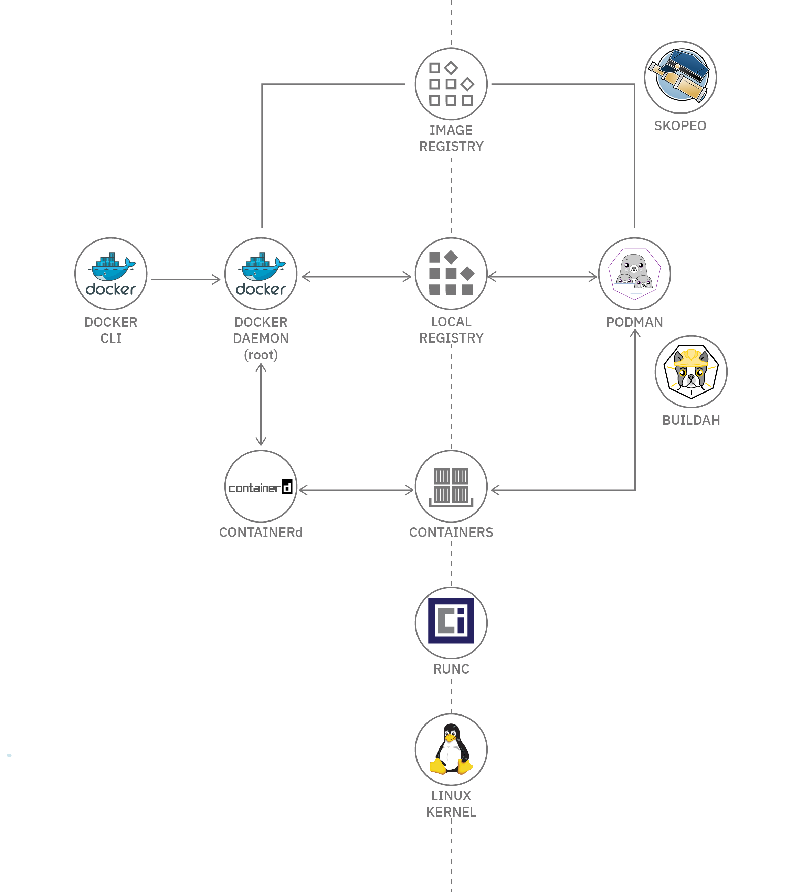

# Containers-Notes

# Standards

<details>
<summary>Click to expand </summary>

### Container Image Standards - App Container (appc)

The App Container (appc) specification was introduced in 2014 by CoreOS in collaboration with Google and RedHat. One of the container runtimes implementing the appc specification is rkt. The appc specification defines a container image format, how an application is packaged into a container image, a deployment mechanism and a runtime.

In addition to defining the Application Container Image (ACI) format for container images, the appc enables the user community to develop tools to build, validate, and convert container images to ACI image format, such as goaci, docker2aci, deb2aci, actool, acbuild, and oci2aci.

The appc specification intends to speed up the design and the deployment of a container while ensuring container image integrity through cryptographic signatures. Appc defines several independent, yet composable, aspects of the application container.

</details>


### Container Image Standards - Open Container Initiative (OCI)

The Open Container Initiative (OCI) was introduced in 2015 by Docker together with other leaders in the container industry. One of the container runtimes implementing the OCI specification is runC.

The OCI incorporates two specifications: the Runtime Specification (runtime-spec) and the Image Specification (image-spec).

The Runtime Specification defines how to run a "filesystem bundle" that is unpacked on disk. An OCI implementation would download and unpack an OCI image into an OCI Runtime filesystem bundle. Then, an OCI Runtime would run the OCI Runtime Bundle.

The Image Specification helps with the development of compatible tools to ensure consistent container image conversion into containers.

- Runtime Specification 
https://github.com/opencontainers/runtime-spec

- Image Format Specification 
https://github.com/opencontainers/image-spec


# Container Runtimes

<details>
<<<<<<< HEAD
<summary>Click to expand </summary>
=======
<summary>Click to expand </summary>
<<<<<<< HEAD
>>>>>>> 038061d... file extension fix
=======
>>>>>>> 038061d3ca8ae488367fb228d517ab05296bea84
>>>>>>> 74799a81cb6b47a6ffc54dbb3da1ec47f524afa5

https://github.com/opencontainers/runc

runc is a basic CLI tool that leverages the libcontainer runtime (initially developed by Docker, then later open sourced), together providing a low level container runtime focused primarily on container execution. runc implements the OCI specification, and it handles the creation and running of OCI containers.

Its simplicity, however, is not without shortcomings. runc does not expose an API and does not provide container image management capabilities. While it does not support image build operations, it does not provide image download or image integrity check capabilities either. That is, the creation of the container image components, such as the OCI bundle, is not part of runc’s scope. runc may aid with the creation of the OCI spec, but the OCI bundle has to be created separately and made available to runc.

Although runc does not include a centralized daemon, it may be integrated with the Linux service manager - systemd.


<table>
<th>Install runc
<th>

```
wget https://github.com/opencontainers/runc/releases/download/v1.0.0-rc95/runc.amd64 && chmod +x runc.amd64
sudo mv runc.amd64 /usr/local/bin/runc

```
<tr>
<th>Install crun - C based alternative
<th>

```
https://github.com/containers/crun
```

<tr>
<td>Create a container in an OCI
bundle format. We will use a busybox Docker container to export its filesystem in a tar archive, and use
the extracted filesystem at as the rootfs.
<td>

```
mkdir -p runc-container/rootfs
sudo docker container export \
$(sudo docker container create busybox) \
> busybox.tar
 tar -C runc-container/rootfs/ -xf busybox.tar
cd runc-container
runc spec


```
<tr>
<td>Run container
<td>

```
sudo runc run busybox
sudo runc list #on other terminal
```

<tr>
<td>List the events of the busybox container
<td>

```
sudo runc events busybox

```
<tr>
<td>Other commands
<td>

```
sudo runc state busybox
sudo runc pause busybox
sudo runc resume busybox
sudo runc delete -f busybox
 ```
</table>
</details>


<details>
<<<<<<< HEAD
<summary>Click to expand </summary>

=======
<summary>Click to expand </summary>

<<<<<<< HEAD
>>>>>>> 038061d... file extension fix
=======
>>>>>>> 038061d3ca8ae488367fb228d517ab05296bea84
>>>>>>> 74799a81cb6b47a6ffc54dbb3da1ec47f524afa5

<table>
<td>Install podman
<td>

```
. /etc/os-release
sudo sh -c "echo 'deb http://download.opensuse.org/repositories/devel:/kubic:/libcontainers:/stable/xUbuntu_${VERSION_ID}/ /' >/etc/apt/sources.list.d/devel:kubic:libcontainers:stable.list"
wget -nv https://download.opensuse.org/repositories/devel:kubic:libcontainers:stable/xUbuntu_${VERSION_ID}/Release.key -O- | sudo apt-key add -
sudo apt update -qq
sudo apt -qq -y install podman
podman --version
```
<tr>
<td>Search for the image
<td>

```
podman search --filter=is-official nginx
INDEX NAME DESCRIPTION STARS OFFICIAL
AUTOMATED
Docker.io docker.io/library/nginx Official build of Nginx. 12795 [OK]
```
<tr>
<td>Pulling an image from the registry to the local repository
<td>

```
podman image pull docker.io/library/nginx
Trying to pull docker.io/library/nginx...
Getting image source signatures
Copying blob 28252775b295 done
Copying blob a616aa3b0bf2 done
Copying blob 68ced04f60ab done
Copying config 6678c7c2e5 [======================================] 6.5KiB /
6.5KiB
Writing manifest to image destination
Storing signatures
6678c7c2e56c970388f8d5a398aa30f2ab60e85f20165e101053c3d3a11e6663
```
<tr>
<td>List images in the local repository
<td>

```
podman image list
REPOSITORY               TAG     IMAGE ID      CREATED      SIZE
docker.io/library/nginx  latest  d1a364dc548d  10 days ago  137 MB
```

<tr>
<td>Display image details
<td>

```
podman image inspect nginx
```


<tr>
<td>Display the updates and changes history of an image
<td>

```
podman image history nginx
ID CREATED CREATED BY
SIZE COMMENT
6678c7c2e56c 7 days ago /bin/sh -c #(nop) CMD ["nginx" "-g" "daemo...
0B
<missing> 7 days ago /bin/sh -c #(nop) STOPSIGNAL SIGTERM
0B
<missing> 7 days ago /bin/sh -c #(nop) EXPOSE 80
...
```

<tr>
<td>Remove an image from the local repository
<td>

```
podman image rm nginx
Untagged: docker.io/library/nginx:latest
Deleted: 6678c7c2e56c970388f8d5a398aa30f2ab60e85f20165e101053c3d3a11e6663

```
<tr>
<td>Remove all dangling images from local repository
<td>

```
sudo podman image prune
WARNING! This will remove all dangling images.
Are you sure you want to continue? [y/N] y
6678c7c2e56c970388f8d5a398aa30f2ab60e85f20165e101053c3d3a11e6663

```
<tr>
<td>Remove all unused images from local repository
<td>

```
sudo podman image prune -a -f
6678c7c2e56c970388f8d5a398aa30f2ab60e85f20165e101053c3d3a11e6663
```
<tr>
<td>Run <b>runc</b> with memory constrain
<td>

```
podman --runtime /usr/bin/runc run --rm --memory 4M fedora echo it works
Error: container_linux.go:346: starting container process caused "process_linux.go:327: getting pipe fds for pid 13859 caused \"readlink /proc/13859/fd/0: no such file or directory\"": OCI runtime command not found error

```


<tr>
<td>Run <b>crun</b> (C based implementation) with memory constrain
<td>

```
podman --runtime /usr/bin/crun run --rm --memory 4M fedora echo it works
it works
```
<tr>
<td>Creating an OCI Bundle
<td>

```
mkdir rootfs
docker export $(docker create busybox) | tar -C rootfs -xvf -
```


</table>
</details>

<details>
<summary>Click to expand </summary>

https://github.com/containerd/containerd

Another simple container runtime is containerd, which adds robustness and portability by supporting several container operations, such as the storage and transfer of container images, executing containers, attaching storage and network to containers.

As an industry-standard container runtime, containerd was designed to run as an embedded daemon of a more robust container management system, and not to be used directly by everyday users. Among the adopters of the containerd daemon are the Docker engine, Kubernetes services of IBM (IKS) and Google Cloud (GKE), Cloud Foundry, and Kata Containers.

containerd supports the OCI container image specification and the OCI runtime specification by utilizing runc as its low level OCI runtime with the possibility to extend it with plugins to support the Kubernetes Container Runtime Interface (CRI) as well. containerd adds implementation for some missing, yet desired, capabilities of runc, such as support for container image pull and push operations, and network interfaces and network namespaces management operations.

<table>
<th>Install containerd
<th>

```
wget https://github.com/containerd/containerd/releases/download/v1.5.2/containerd-1.5.2-linux-amd64.tar.gz
sudo tar -xzf containerd-1.5.2-linux-amd64.tar.gz -C /usr/local/
```
</table>

</details>

<details>
<summary>Click to expand </summary>

https://github.com/cri-o/cri-o

CRI-O is a minimal implementation of the Container Runtime Interface (CRI) to enable the usage of any Open Container Initiative (OCI) compatible runtime with Kubernetes, a popular container orchestrator. As a lightweight alternative to using Docker or rkt as the runtimes for Kubernetes, it supports both GPG signed and unsigned container images. CRI-O supports runc and Kata Containers as the container runtimes but any OCI-conformant runtime can be plugged in instead.

The CRI-O runtime has been optimized for Kubernetes, and it also implements the Container Network Interface (CNI) for networking and supports CNI plugins. Architecturally, CRI-O is packed with libraries that pull container images from registries and create container filesystems, a tool that prepares container configuration, then it invokes runc to start containers which end up being handled by conmon, a daemon that collects logs and monitors for hazards such as out of memory (OOM) conditions. CRI-O also supports container security that is provided by several core Linux features such as SELinux, capabilities or seccomp.
</details>

<details>
<summary>Click to expand </summary>
See: 

https://github.com/Pwera/Docker-Notes

</details>

<details>
<summary>Click to expand </summary>
// TODO:
</details> 

<details>
<summary>Click to expand </summary>

// TODO:
</details>


# Linux features

- chroot
- SELinux
- capabilities
- seccomp